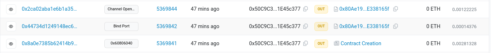

# EVM-IBC; Supercharged

This repository is a template that you can fork to build a cross-chain protocol on the Union testnet, connecting to Sepolia.

The template demonstrates a simple [ping-pong](https://union.build/docs/demos/pingpong/) as an example protocol, with implementatinos in both rust ([Cosmwasm](https://cosmwasm.com/)) and Solidity.

## Development environment

We use [nix](https://nixos.org/) to set up our development environment. We recommend using the [Determinate Systems nix installer](https://zero-to-nix.com/start/install). After installing nix, run `nix develop` from the repository root to enter a shell with all of the required tools.

If you don't want to install nix, here are the required tools:
- make (GNU Make 4.4.1)
- jq (jq-1.7.1)
- forge (0.2.0 (2cb8757 2024-02-03T00:16:46.961268899Z))
- rustup (see ./rust-toolchain)
- binaryen (wasm-opt version 116)
- docker (24.0.5)

## Hacking the protocol

The protocol is a simple ping pong implementation.
Implementing a different protocol from this base should be straightforward.

## Building and uploading

We provide a Makefile to build the contracts and upload them on chain.
You will first need to deploy the Cosmwasm contract to deploy the Solidity contract as the IBC channel will be opened from Sepolia (OpenInit). Voyager will automatically pickup channel opening and ensure the handshake is fully executed. It will also ensure packets relaying between the two contracts.

Make sure to have:
- a Union account funded with enough UNO tokens (we name it `UNION_HEX_PRIVATE_KEY`)
- a Sepolia account funded with enough ETH tokens (we name it `SEPOLIA_HEX_PRIVATE_KEY`)

### Cosmwasm

Run the following command and make sure to save the resulting value (we name it `COSMWASM_CONTRACT_ADDRESS`) to then deploy the solidity contracts:
`PRIVATE_KEY=<UNION_HEX_PRIVATE_KEY> make deploy-union`

https://testnet.union.explorers.guru

### Solidity

Make sure you have the cosmwasm address by deploying it first, then run:
`COSMWASM_CONTRACT_ADDRESS=<ADDR> PRIVATE_KEY=<SEPOLIA_HEX_PRIVATE_KEY> make deploy-evm`

Go to [sepolia etherscan](https://sepolia.etherscan.io) and ensure the contract is created, the port is bound and that the `ChannelOpenInit` has been initiated:

## Calling the contracts

FILL THIS IN WITH INFO FROM OMAR

## Helpful links

- Cosmwasm docs: https://book.cosmwasm.com/
- Solidity docs: https://docs.soliditylang.org/en/v0.8.24/
- Foundry docs: https://book.getfoundry.sh/

